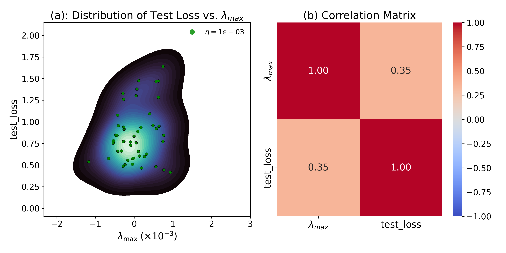
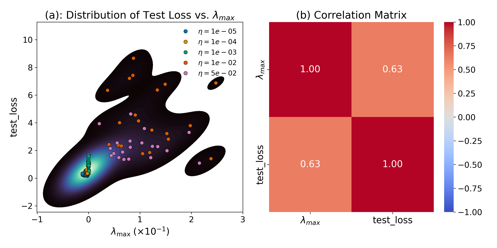
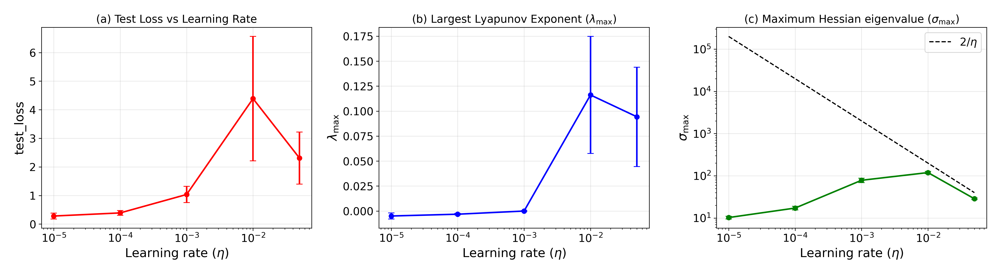

# Learning Without Chaos: Lyapunov spectra and Generalization in Deep Neural Networks

In this project we study the correlation between maximum Lyapunov exponent and generalization performance


## Overview
Understanding why deep neural networks generalize well despite overparameterization remains a 
fundamental challenge in machine learning. Insights into this phenomenon are essential for 
improving the reliability and interpretability of AI systems across domains. Existing explanations 
often rely on static analyses of the loss landscape, such as curvature via Hessian eigenvalues, 
which provide geometric insights but overlook the dynamic nature of optimization. 
A principled way to link training stability to generalization is still missing. 
Here, we propose a complementary perspective: analyzing the Lyapunov spectrum of training dynamics 
to study generalization. We hypothesize that non-chaotic, stable dynamics—reflected in predominantly
negative or near-zero Lyapunov exponents—correlate with improved generalization. 
For nonlinear regression with a Mean Squared Error (MSE) loss, trained using 
Stochastic Gradient Descent (SGD) on a three-layered network with non-linear activation functions, 
we demonstrate that stable training dynamics—characterized by a negative or 
near-zero largest Lyapunov exponent—correlate with good generalization performance, 
as reflected in low test loss. This dynamical systems perspective bridges geometric and temporal analyses, 
offering a deeper understanding of generalization behavior. 

## Organization of Files

- `Study_A.py` — Trains the MLP across different weight initializations with fixed learning rate and batch size and computes the max lyapunov exponent. The data is saved in `results_random_weight.npz` file.
- `Study_B.py` — Trains the MLP across different learning rates with fixed  batch size and computes the max lyapunov exponent. The data is saved in `results_random_lr.npz` file.
- `plot_results.py` — Plots the results and reproduces the figures used in the manuscript.

## Installation
Install the required Python(Python version 3.10 recommended) packages (modify the PyTorch version in `requirements.txt` to match your device) as follows:

## Environment Setup (Recommended: Conda)

Create a new conda environment with Python 3.10 (or any version ≥ 3.8):

```bash
conda create -n lyap_exp python=3.10 -y
```
Activate the environment:
```bash
conda activate lyap_exp
```
Install the required dependencies:

```bash
pip install -r requirements.txt
```


## Execution

To generate data to reproduce **Figure 1** in the manuscript, please run to first generate the data by running

```bash
python3 Study_A.py
```

This step produces a `results_random_weight.npz` file that can be analyzed and plotted.

Before running the plotting script, update **line 20** in `plot_results.py` so it points to the correct location of `results_random_weight.npz` on your system.

Then run:

```bash
python3 plot_results.py

```

## Test loss vs Max Lyapunov Exponent for different parameter initializations



Correlation Results between `test_loss` and  `λmax` for different parameter initializations
```bash
Pearson r: 0.34530218186201544 p-value: 0.014050874628482058 
Spearman ρ: 0.16859543817527012 p-value: 0.24184094814296866 
✔️ Statistically significant (p < 0.05)
```

Likewise, to reproduce **Figure 2** in the manuscript, please run to first generate the data by running

```bash
python3 Study_B.py
```

This step produces a `results_random_lr.npz` file that can be analyzed and plotted.

Before running the plotting script, update **line 20** in `plot_results.py` so it points to the correct location of `results_random_weight.npz` on your system.

Then run:

```bash
python3 plot_results.py
```

## Test loss vs Max Lyapunov Exponent for different learning rates




Correlation Results between `test_loss` and  `λmax` for different learning rates
```bash
Pearson r: 0.6308704941000116 p-value: 1.9918209194174005e-12
Spearman ρ: 0.8588178817881787 p-value: 3.173921991080019e-30
✔️ Statistically significant (p < 0.05)
```


# Test loss, Max Lyapunov Exponent vs for different learning rates




## Pre-trained Model and Data

Pre-generated files `results_random_weight.npz` and `results_random_lr.npz` are included to avoid the need for long training runs.

You can directly execute `plot_results.py` after updating **line 20** to point to the correct path of `results_random_weight.npz` on your system.